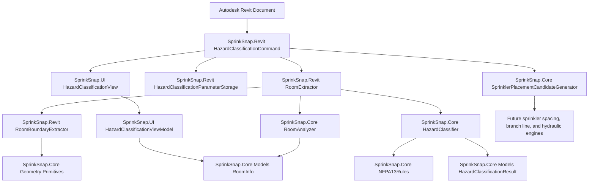

# SprinkSnap Hazard Classification Dependency Flow

Recommended command rename: `HazardClassificationCommand.cs`.

The command owns Revit workflow orchestration only. Extraction, geometry analysis, hazard suggestion,
parameter persistence, and designer review are split into services to keep the system testable and
ready for future sprinkler layout and hydraulic modules.

## Boundary rules

- `SprinkSnap.Core` has no Revit or WPF dependencies.
- `SprinkSnap.Revit` adapts Autodesk Revit API elements into Core models and writes approved data back to Revit.
- `SprinkSnap.UI` owns designer review and approval state via MVVM.
- Hazard classification remains suggestion-only; `SS_HazardClassification` stores the designer-approved value.
- Sprinkler placement candidates are conceptual room data only. Final sprinkler placement and NFPA 13 compliance checks are future modules.

