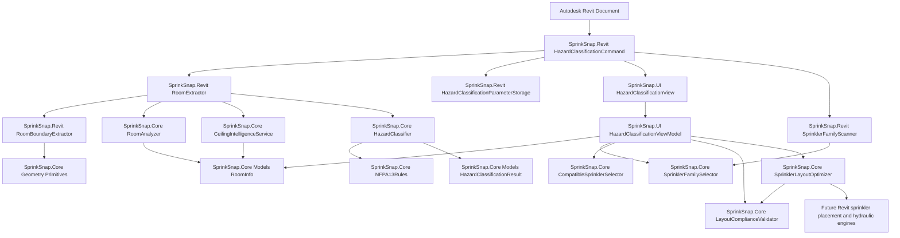

# SprinkSnap Hazard Classification Dependency Flow

Recommended command rename: `HazardClassificationCommand.cs`.

The command owns Revit workflow orchestration only. Extraction, geometry analysis, ceiling
intelligence, hazard suggestion, listed-family selection, compliance validation, constrained layout
optimization, parameter persistence, and designer review are split into services to keep the system
testable and ready for future sprinkler layout and hydraulic modules.

## Boundary rules

- `SprinkSnap.Core` has no Revit or WPF dependencies.
- `SprinkSnap.Revit` adapts Autodesk Revit API elements into Core models and writes approved data back to Revit.
- `SprinkSnap.UI` owns designer review and approval state via MVVM.
- Hazard classification remains suggestion-only; `SS_HazardClassification` stores the designer-approved value.
- Automatic layout runs only after input compliance validation.
- Rooms with missing critical geometry, uncertain ceiling classification, unsupported selected families, or detected obstructions are flagged for review instead of guessed.
- Sprinkler placement candidates are preview data only. A future placement command should write Revit sprinklers after final approval.
- Sprinkler family selection uses a catalog-first workflow: manufacturer, category, orientation, K-factor, and model/SIN.
- Loaded Revit sprinkler families should be recognized from `SS_*` shared parameters first, then by family/type name catalog matching, then by manual mapping if unknown.

